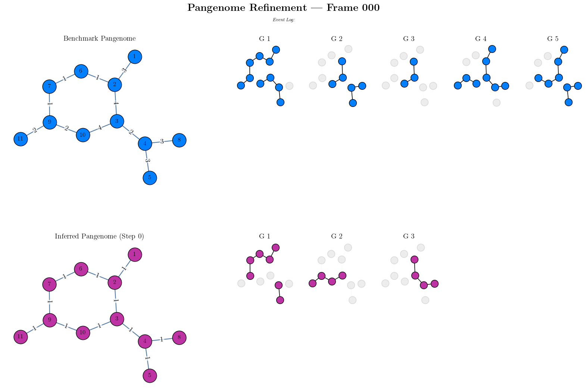

[](https://www.python.org/downloads/) [](https://github.com/astral-sh/uv) [](https://github.com/psf/black) [](https://opensource.org/licenses/MIT)

# Pangesim

### Reconstructing genome sets from adjacency information using combinatorial optimization

------

## Overview

Pangenomes are commonly represented as sets of genomes sharing a subset of genes and genomic adjacencies.

In many situations, however, only  adjacency information (sequencing reads, synteny blocks) is available:

- Which gene adjacencies exist?
- How frequently does each adjacency appear?
- Which genes are conserved across all genomes?

Recovering the original set of genomes from this compressed representation is not straightforward.

This project investigates the reconstruction of pangenomes and its constituent genomes from adjacency data alone.

The repository contains:

- A simulator of pangenome evolution
- Synthetic benchmark generation
- Reconstruction heuristics
- Evaluation metrics
- Experimental notebooks

---

## The Combinatorial Challenge 

A pangenome can be viewed as a collection of genome paths traversing an adjacency graph. Because distinct genome combinations can induce identical edge frequency distributions, reconstruction is inherently non-unique:

The figure below illustrates the challenge:


Our input (on the left) is a graph that represents the known adjacencies between the genes. The weight of its edges represents the number of times that this adjacency was reported on the data. Our goal is to find a  Pangenome $$\mathcal{P}$$ that could explain this data. However, there could exist more than one explanation, as we can see on the right: there are two pangenomes that could explain the graph on the left.

------


## Core Components 

### 1. 🧬 Pangenome Evolution Simulator 

(`panevolve`) Generates synthetic benchmark datasets starting from ancestral genomes along simulated species trees via: 

- Gene loss & insertion events

- Structural genome rearrangements 

- Ground-truth tracking for core genomes, pathway matrices, and evolutionary histories 

### 2. 🧩 Reconstruction & Refinement Pipeline 

(`reconstruction`) A three-phase heuristic pipeline designed to recover individual genome pathways: 

- **Phase 1 (Eulerian trials):** Finds Eulerian trails by transforming the input adjacencies into an eulerian graph. 

- **Phase 2 (Assignment):** Transforms the trails into a set of genomes. 

- **Phase 3 (Refinement):** Iterative greedy hill-climbing optimization using `fix_under_edge` and `fix_over_edge` routines to minimize edge residuals. 

### 3. 📊 Visual Tracking Engine 

(`visualization`) Features `SmartRefinementVisualizer`, a delta-aware dashboard comparing **Ground Truth (`#007FFF`)** against **Inferred Pangenomes (`#BD33A4`)** across stacked genome subgrids, complete with explicit numeric edge weights and action logs. 



## Repository Structure

```text
.
├── src/pangesim/
│   ├── datastructures/#Pangenome models
│   ├── metrics/ #Scoring functions
│   ├── panevolve/ #main simulator
│   ├── reconstruction/ #algorithms and heuristics
│   └── visualization/ #SmartRefinementVisualizer & plot rederings
│
|
├── benchmarks/ # Pangenome Reconstruction Experiments
│   ├── config.py # Heuristic and simulation parameters
│   ├── fixtures.py # Mock pangenome generator
│   ├── run_single_scenario.py
│   ├── runners.py
│   └── tracking.py
|
├── scripts/ # Pangenome generation Experiments
│   ├── run_example.py
│   ├── run_peeling.py
│   └── run_strategy_comparison.py
│
├── docs/
│   ├── images/ #Dashboards and architecture diagrams
│   ├── CHANGELOG.md
│   └── contributing.md
│
├── tests/ # Unit tests
│
└── README.md
```

------

## Quick start guide

This project uses `pygraphviz` and `LaTeX` for high-fidelity pangenome network visualizations. Because these depend on system-level binaries, you must install them on your machine before setting up the Python environment.

### 1. Install System Dependencies
#### 🍏 macOS (via Homebrew)
```bash
brew install graphviz mactex-no-gui
```
#### 🐧 Ubuntu/Linux
```bash
sudo apt-get update
sudo apt-get install graphviz graphviz-dev texlive-full
```

### 2. Initialize Python Environment
Once system binaries are installed, let `uv` handle the rest:
```bash
uv sync --all-groups
```


We provide a built-in smoke test script to quickly verify your installation, run a toy pangenome evolution simulation, and output a structural grid visualization.

### Running the sample simulation 

You can execute the example script directly using `uv`:

```bash
uv run python ./scripts/run_example.py 
```

The resulting output should look like this:


------

## Research Questions

This repository explores questions such as:

- How much information is lost when only adjacency data is available?
- Which adjacency graph properties make reconstruction difficult or non-unique?
- How accurately can endogenous edge frequencies be recovered?
- How does evolutionary complexity affect reconstruction quality?

------

## Status

Current stage:

-  Pangenome simulator (In progress)
-  Ground-truth generation (In progress)
-  Reconstruction heuristic benchmarking (In progress)
-  Comparative baselines (Future work)
-  Large-scale experiments (Future work)


## Contributing

Please see [CONTRIBUTING.md](CONTRIBUTING.md) for
development setup and coding standards guidelines.
